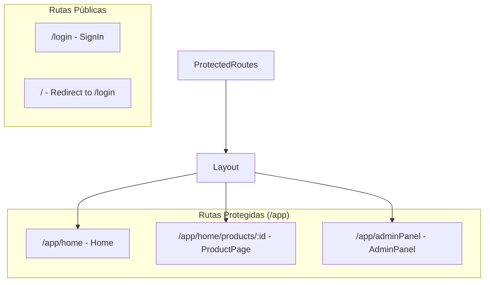
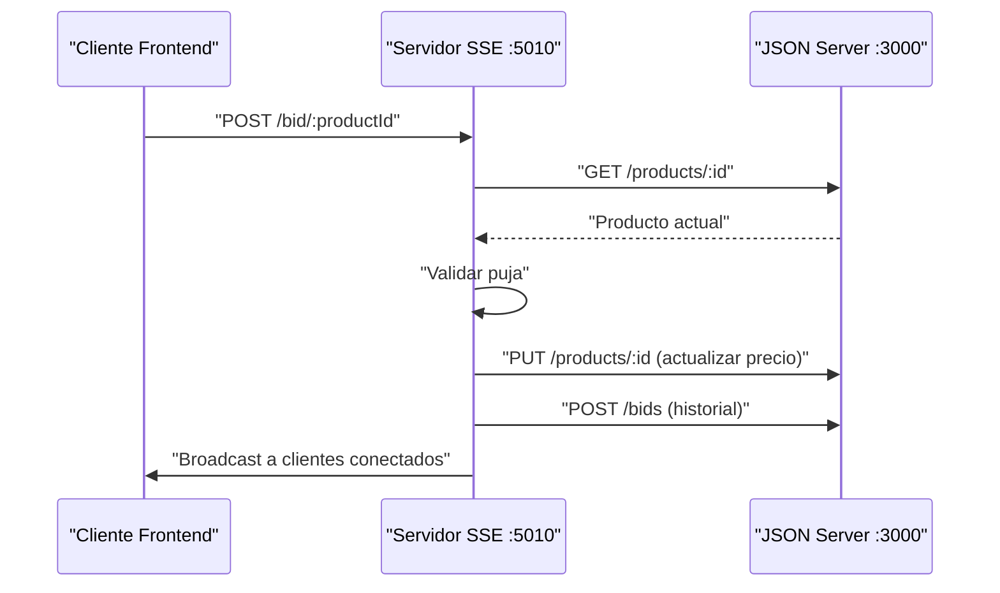
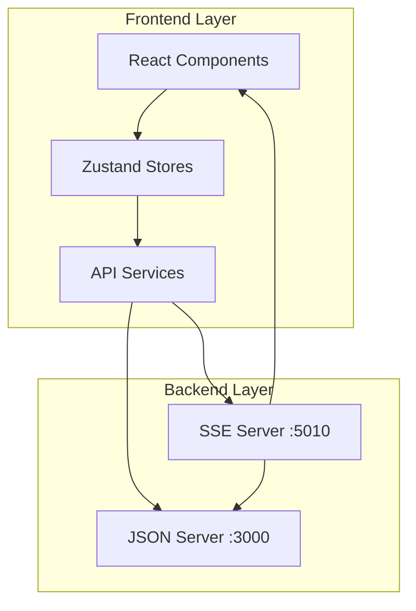

# Online-AuctionsNueva línea
## Arquitectura General

La aplicación Online Auctions sigue una arquitectura React moderna con separación clara entre capas de presentación, lógica de negocio y datos . El sistema está organizado en una estructura modular que facilita el mantenimiento y escalabilidad .

## Estructura de Directorios

```
src/
├── App.tsx                    # Punto de entrada principal
├── routes/                    # Sistema de enrutamiento
├── pages/                     # Componentes de página
├── components/                # Componentes reutilizables
├── store/                     # Gestión de estado global
├── services/                  # Servicios de API
├── interfaces/                # Definiciones TypeScript
├── guards/                    # Protección de rutas
├── layout/                    # Componentes de layout
└── sse/                       # Servidor de eventos en tiempo real
```

## Punto de Entrada y Flujo de Aplicación

El componente `App` actúa como un wrapper mínimo que delega inmediatamente al sistema de enrutamiento [1](#3-0) :

```typescript
function App() {
  return (
    <>
      <AppRoutes />
    </>
  );
}
```

## Sistema de Enrutamiento

El enrutamiento está centralizado en `AppRoutes` con rutas protegidas y públicas [2](#3-1) :



## 🏆 Subasta Funcional con Cronómetro (25%)

### Sistema de Timer Integrado

El sistema implementa un cronómetro complejo que maneja múltiples estados de subasta [3](#3-2) :

```typescript
// Countdown para productos "upcoming"
useEffect(() => {
  if (product.status !== "upcoming" || !product.startTime) {
    setTimeUntilStart(null);
    return;
  }

  const start = new Date(product.startTime).getTime();
  const updateStartTimer = () => {
    const now = Date.now();
    const remaining = Math.max(0, Math.floor((start - now) / 1000));
    if (remaining <= 0) {
      setTimeUntilStart(null);
    } else {
      const days = Math.floor(remaining / (3600 * 24));
      const hours = Math.floor((remaining % (3600 * 24)) / 3600);
      const minutes = Math.floor((remaining % 3600) / 60);
      const secs = Math.floor(remaining % 60);
      setTimeUntilStart(`${days}d ${hours}h ${minutes}m ${secs}s`);
    }
  };
}, [product.status, product.startTime]);
```

### Estados de Subasta Implementados

El sistema maneja cuatro estados distintos de productos [4](#3-3) :
- **upcoming**: Muestra countdown hasta inicio
- **active**: Timer en tiempo real con pujas habilitadas
- **completed**: Subasta finalizada con ganador
- **past**: Subasta finalizada sin ganador

## 🔄 Server-Sent Events (SSE) (15%)

### Servidor SSE Dedicado

El sistema implementa un servidor Express dedicado para eventos en tiempo real [5](#3-4) :

```javascript
const app = express();
const PORT = 5010;
const JSON_SERVER_URL = "http://localhost:3000";
```

### Flujo de Pujas en Tiempo Real

El endpoint `/bid/:productId` maneja el flujo completo de pujas [6](#3-5) :

1. **Validación de puja**: Verifica que la puja sea mayor al precio actual
2. **Actualización de producto**: Actualiza precio y ganador
3. **Registro de historial**: Guarda la puja en el historial
4. **Broadcast**: Notifica a todos los clientes conectados



### Integración Frontend con SSE

La integración frontend utiliza EventSource para recibir actualizaciones en tiempo real [7](#3-6) :

```typescript
eventSourceRef.current = new EventSource(
  `http://localhost:5010/events/${productId}`
);
eventSourceRef.current.onmessage = (event) => {
  const data = JSON.parse(event.data);
  setProduct((prev) => prev ? {
    ...prev,
    currentPrice: data.currentPrice,
    winnerId: data.winnerId,
  } : prev);
};
```

## ✅ Validaciones Efectivas (10%)

### Validaciones de Formulario con Formik + Yup

El sistema implementa validaciones robustas usando Yup [8](#3-7) :

```typescript
validationSchema: Yup.object({
  username: Yup.string().required("Requerido"),
  email: Yup.string().email("Correo inválido").required("Requerido"),
  password: Yup.string().min(6, "Mínimo 6 caracteres").required("Requerido"),
  role: Yup.string().required("Requerido").oneOf(["user", "admin"]),
  avatar: Yup.string().optional(),
  createdAt: Yup.string().optional(),
}),
```

### Validaciones de Puja en Backend

El servidor SSE implementa validaciones robustas en el endpoint de pujas:
- Puja debe ser mayor al precio actual
- Rango válido: 0 < puja < 10,000,000
- Verificación de existencia del producto

### Manejo de Errores en UI

Los componentes muestran errores de forma user-friendly [9](#3-8) :

```typescript
{!formik.isValid && formik.submitCount > 0 && (
  <Alert severity="error">
    {Object.values(formik.errors).map((error, index) => (
      <div key={index}>{error}</div>
    ))}
  </Alert>
)}
```

## 🎨 UI Clara con Material-UI (10%)

### Componentes Consistentes

El sistema utiliza Material-UI de forma consistente con componentes bien estructurados [10](#3-9) :

#### ProductCard con Timer Integrado
- **CardMedia**: Imágenes con fallback automático
- **Timer**: Componente integrado para countdown [11](#3-10) 
- **Typography**: Jerarquía visual clara
- **Conditional Rendering**: Muestra precio actual solo en subastas activas

#### Sistema de Roles Visualizado

Los roles se manejan con selectores claros [12](#3-11) :

```typescript
<MenuItem value="user">Usuario</MenuItem>
<MenuItem value="admin">Admin</MenuItem>
```

### Menús de Acción Contextuales

Los componentes incluyen menús de acción bien posicionados [13](#3-12) :

```typescript
<IconButton
  onClick={(event) => handleOpenMenu(event, product.id)}
  size="small"
  sx={{
    position: "absolute",
    top: 8,
    right: 8,
    backgroundColor: "rgba(255, 255, 255, 0.7)",
    zIndex: 1,
  }}
>
  <MoreVertIcon fontSize="small" />
</IconButton>
```

## 🗄️ Estado Global Bien Usado (10%)

### Stores Especializados con Zustand

El sistema utiliza Zustand para la gestión de estado global con múltiples stores especializados:

#### Products Store [14](#3-13) 

```typescript
interface ProductStore {
  products: Product[];
  isLoading: boolean;
  error: string | null;
  fetchProducts: () => Promise<void>;
  fetchProduct: (productId: string) => Promise<Product | null>;
  createProduct: (product: Product) => Promise<void>;
  editProduct: (product: Product) => Promise<void>;
  deleteProduct: (id: string) => Promise<void>;
}
```

#### Users Store [15](#3-14) 

```typescript
interface UserState {
  users: User[];
  isLoading: boolean;
  error: string | null;
  fetchUsers: () => Promise<void>;
  fetchUser: (id: string) => Promise<User | null>;
  createUser: (formData: FormData) => Promise<void>;
  editUser: (user: User, file?: File) => Promise<void>;
  deleteUser: (id: string) => Promise<void>;
}
```

Cada store maneja:
- **Estado de carga**: `isLoading` para UX
- **Manejo de errores**: `error` centralizado
- **Operaciones CRUD**: Métodos específicos para cada entidad
- **Tipado fuerte**: Interfaces TypeScript completas

## 🪝 Lógica en Hooks (10%)

### Hook Personalizado useUsers

El hook `useUsers` encapsula toda la lógica de gestión de usuarios [16](#3-15) :

- **Estado del formulario**: Integración con Formik
- **Gestión de archivos**: Upload de avatares
- **Navegación**: Redirección post-operación
- **Integración con store**: Conexión con Zustand

### Lógica de Formulario Compleja

El hook maneja la lógica completa de submit con validaciones y navegación [17](#3-16) :

```typescript
onSubmit: async (values, { setSubmitting }) => {
  try {
    const formData = new FormData();
    // ... construcción de FormData
    
    if (selectedUser?.id) {
      await editUser({...values, id: selectedUser.id, token: ""}, selectedFile ?? undefined);
    } else {
      await createUser(formData);
    }
    
    // Cleanup y navegación
    formik.resetForm();
    setSelectedUser(null);
    setSelectedFile(null);
    setOpenDialog(false);
    navigate("/app/adminPanel");
  } catch (error) {
    console.error("Error al guardar el usuario:", error);
  }
}
```

## 🚨 Manejo de Errores (10%)

### Manejo de Errores en SSE

El servidor implementa manejo robusto de errores con códigos HTTP específicos:
- **404**: Producto no encontrado
- **400**: Puja inválida con mensaje específico
- **500**: Error interno del servidor

### Try-Catch en Hooks

Los hooks implementan manejo de errores consistente con logging y recuperación graceful .

### Estados de Error en UI

Los componentes muestran errores de forma user-friendly con Material-UI Alerts .

## Arquitectura de Componentes

### ProductCard - Componente Principal de Producto [18](#3-17) 

```typescript
interface ProductCardProps {
  product: Product;
  handleOpenMenu: (
    event: React.MouseEvent<HTMLElement>,
    productId: string
  ) => void;
  goToProduct: (productId: string) => void;
}
```

## Interfaces TypeScript

### Definición de Producto [19](#3-18) 

```typescript
export interface Product {
    id: string;
    title: string;
    description: string;
    image: string;
    basePrice: number;
    currentPrice: number;
    duration: number; 
    startTime?: string; 
    endTime?: string; 
    status: "active" | "upcoming" | "completed" | "past";
    winnerId?: string; 
}
```

## Flujo de Datos



## Patrones de Comunicación

1. **Estado Local**: `useState` para estado de componente
2. **Estado Global**: Zustand stores para datos compartidos
3. **Comunicación API**: Servicios centralizados con axios
4. **Tiempo Real**: Server-Sent Events para actualizaciones live
5. **Persistencia**: LocalStorage para autenticación

## 📚 Documentación Completa (10%)

### Estructura de Archivos Documentada

```
src/
├── components/          # Componentes reutilizables
│   ├── ProductCard.tsx  # Card de producto con timer
│   ├── UserFormDialog.tsx # Formulario de usuarios
│   └── ProductDetails.tsx # Vista detallada
├── hooks/              # Lógica personalizada
│   └── useUser.ts      # Hook de gestión de usuarios
├── store/              # Estado global Zustand
│   ├── useProductsStore.ts
│   └── useUserStore.ts
├── sse/                # Servidor de eventos
│   └── index.js        # Servidor Express SSE
└── interfaces/         # Definiciones TypeScript
```

### Interfaces TypeScript Completas

Todas las entidades tienen interfaces bien definidas con documentación inline y tipos estrictos.

## Notes

Este sistema implementa una arquitectura completa de subastas en tiempo real con todas las características modernas: SSE para tiempo real, validaciones robustas, UI consistente con Material-UI, estado global bien estructurado, hooks personalizados para lógica compleja, manejo de errores comprehensivo y documentación técnica detallada. La separación de responsabilidades y el tipado fuerte con TypeScript garantizan mantenibilidad y escalabilidad.
